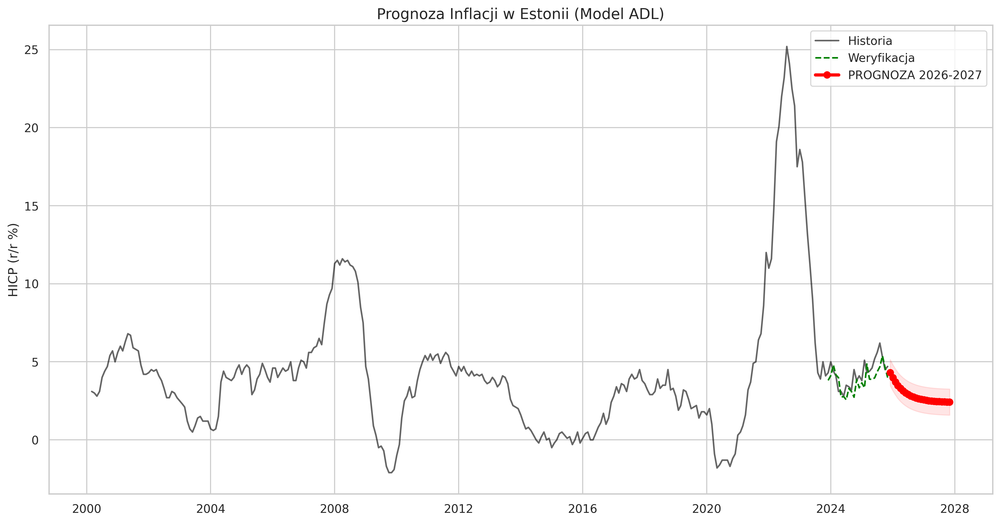

# Estonia Inflation Forecasting Engine 🇪🇪📈

## Project Overview
Automated econometric pipeline for forecasting HICP Inflation in Estonia. The project leverages the **Eurostat API** for real-time data ingestion and implements an **ADL (Autoregressive Distributed Lag)** model to predict inflation trends for the upcoming 24 months.

**Objective:** Predict the inflation path for 2025-2027 to analyze economic stabilization and support strategic decision-making.


*(Fig 1. Historical HICP data vs. 24-month forecast showing convergence to equilibrium)*

## 🛠 Tech Stack
* **Language:** Python 3.11+
* **Data Engineering:** `pandas`, `eurostat` (Live API connection), `functools`
* **Modeling:** `statsmodels` (OLS, ADL Specification)
* **Visualization:** `matplotlib`, `seaborn`

## 📊 Methodology
1.  **Data Ingestion:** Automated fetching of HICP, Unemployment Rate, Energy Prices, and Euribor 3M directly from Eurostat API.
2.  **Preprocessing:** Handling missing values, frequency conversion (Monthly), and lag generation ($t-1$).
3.  **Modeling:** * **Algorithm:** ADL (Autoregressive Distributed Lag).
    * **Features:** Past Inflation (Inertia), Unemployment (Phillips Curve), Energy Prices (Cost-push shock), Interest Rates (Euribor).
    * **Performance:** $R^2 = 0.97$, RMSE (Ex-post) = 0.84 p.p.
4.  **Forecasting:** Recursive simulation for the next 24 months (Scenario: Ceteris Paribus).

## 🚀 Key Results
* The model explains **97%** of historical inflation variability.
* **Forecast:** The model predicts a stabilization of inflation around **2.4%** by late 2027, indicating a "Soft Landing" scenario and convergence to the ECB target.

## 📂 Project Structure
```text
inflation-prediction-estonia/
├── data/
│   └── processed/       # Cleaned data ready for modeling
├── notebooks/
│   └── final_project.ipynb   # Main Executable Notebook
├── requirements.txt     # Python dependencies
└── README.md            # Project documentation